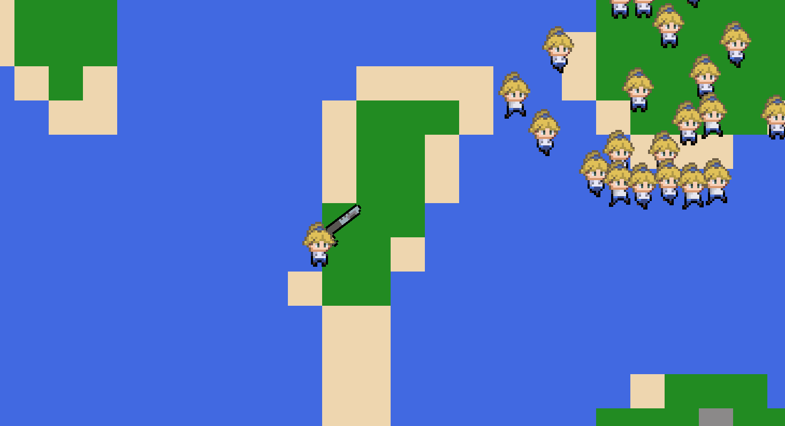

<h1 align="center" id="title">2D Top Down Game</h1>

A rough draft of a top down shooter game developed using the Pygame library.

<h2>💻 Current status</h2>

- From-scratch development of game engine with collision, character movement with camera system, and basic enemy AI
- Chunk-loading system to handle infinitely large maps
- In progress: development of procedural terrain generation (current progress in code/terrain_generation_test.ipynb)